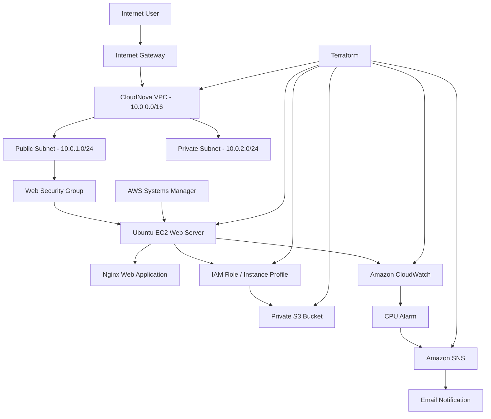
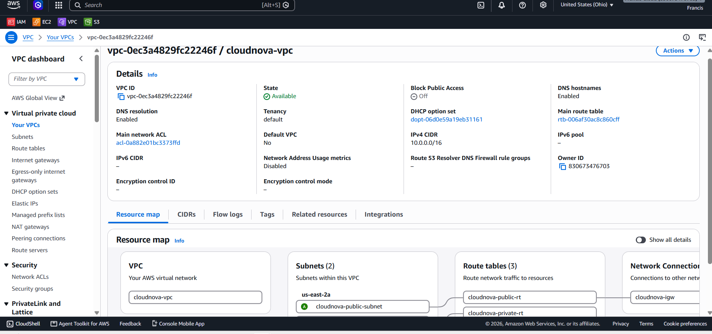
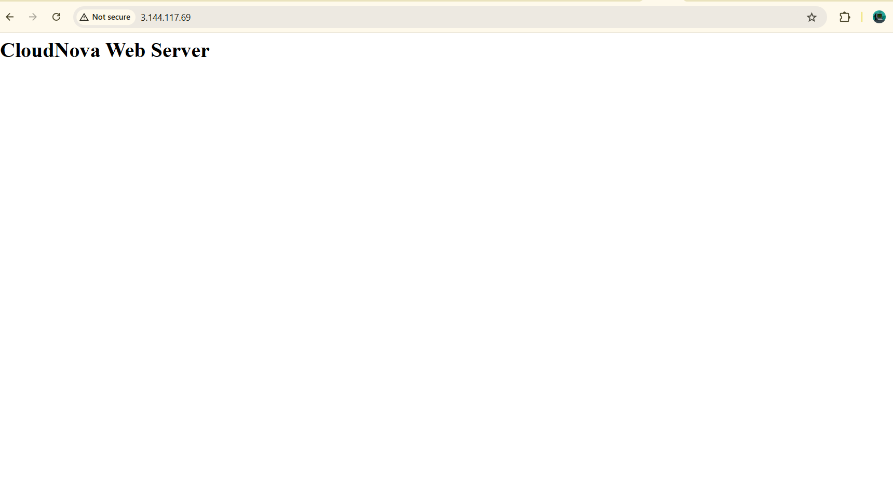
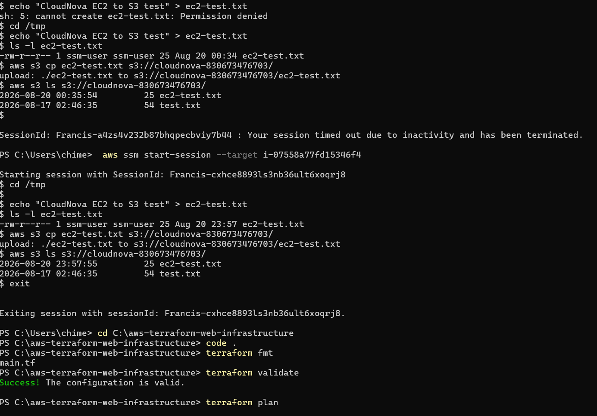
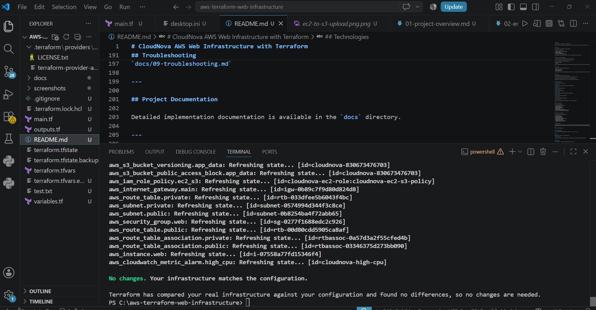

# CloudNova AWS Web Infrastructure with Terraform

## Project Overview

CloudNova is a production-style AWS infrastructure portfolio project designed and deployed using Terraform Infrastructure as Code.

The objective was to build a secure, repeatable, monitored AWS environment for hosting a web application while demonstrating infrastructure automation, AWS networking, identity management, storage integration, systems management, monitoring, testing, and troubleshooting.

The infrastructure was provisioned through Terraform rather than manually creating individual AWS resources through the AWS Management Console.

---

## Business Problem

A growing organization needs an AWS environment for a web application that can be deployed consistently and managed through code.

Manual infrastructure provisioning introduces challenges such as:

- Configuration inconsistency
- Repetitive deployment work
- Human error
- Limited change visibility
- Difficult environment recreation
- Weak infrastructure documentation

Terraform was selected to define the required AWS infrastructure as code.

---

## Architecture

The environment includes:

- Amazon VPC
- Public subnet
- Private subnet
- Internet Gateway
- Public and private route tables
- Security Group
- Amazon EC2
- IAM Role and Instance Profile
- AWS Systems Manager Session Manager
- Amazon S3
- Amazon CloudWatch
- Amazon SNS
### Infrastructure Architecture

---

## Network Design

VPC:

`10.0.0.0/16`

Public subnet:

`10.0.1.0/24`

Private subnet:

`10.0.2.0/24`

The EC2 web server is deployed in the public subnet.

The private subnet provides network separation for resources that should not require direct public exposure.

---

## Web Server

Terraform provisions an Ubuntu 24.04 EC2 instance.

EC2 user data automatically:

1. Updates the operating system packages.
2. Installs Nginx.
3. Enables the Nginx service.
4. Starts the web server.
5. Creates a CloudNova landing page.

The deployment was verified by accessing the web server through its public IP address.

---

## Identity and Access Management

The EC2 instance uses an IAM Role through an Instance Profile.

No long-term AWS access keys are stored on the EC2 instance.

The EC2 role provides controlled permissions for:

- AWS Systems Manager
- Amazon S3

AWS Systems Manager Session Manager is used for administrative access instead of relying on an EC2 SSH key pair.

---

## S3 Storage

Terraform provisions a private S3 bucket with:

- Public access blocking
- Object versioning
- IAM Role-based access

The EC2 instance was tested by uploading an object directly to S3 using permissions obtained from its IAM Role.

---

## Monitoring

Amazon CloudWatch monitors EC2 CPU utilization.

A CloudWatch alarm monitors CPU utilization against a defined threshold.

Amazon SNS provides the notification channel for operational alerts.

CloudWatch CPU datapoints and alarm status were verified through the AWS CLI.

---

## Terraform Workflow

The infrastructure lifecycle uses:

`terraform init`

Initializes the Terraform working directory and AWS provider.

`terraform fmt`

Formats Terraform configuration.

`terraform validate`

Validates configuration syntax.

`terraform plan`

Reviews proposed infrastructure changes before deployment.

`terraform apply`

Creates or modifies AWS infrastructure.

`terraform state`

Tracks Terraform-managed infrastructure.

`terraform destroy`

Removes Terraform-managed infrastructure when it is no longer required.

---

## Security Decisions

The project incorporates:

- IAM Role-based EC2 permissions
- Systems Manager access
- Private S3 storage
- S3 public access blocking
- Network segmentation
- Security Groups
- Terraform variable separation
- Sensitive Terraform files excluded from Git
- No hard-coded AWS credentials in Terraform

---

## Testing and Verification

The environment was validated through:

- Terraform validation
- Terraform planning
- AWS Console verification
- AWS CLI verification
- Web server browser testing
- Systems Manager connectivity testing
- EC2 IAM Role verification
- EC2-to-S3 object upload
- CloudWatch CPU metric verification
- CloudWatch alarm verification

---

## Project Evidence

### AWS Networking

Custom AWS VPC used for the CloudNova infrastructure.

### EC2 Deployment

Ubuntu EC2 instance successfully provisioned through Terraform.

### Nginx Web Server

CloudNova web page served by Nginx running on the Terraform-provisioned EC2 instance.

### Systems Manager Access

AWS Systems Manager Session Manager used to access the EC2 instance without relying on an SSH key pair.

### EC2 to S3 Integration

File uploaded directly from EC2 to S3 using permissions provided through the EC2 IAM role.

### CloudWatch Monitoring

CloudWatch CPU alarm successfully configured and verified.

### Terraform Verification

Final Terraform plan confirmed that the deployed infrastructure matched the Terraform configuration.

## Troubleshooting

The project includes documentation of real deployment and configuration problems encountered during implementation, including IAM permissions, SSM connectivity, AWS CLI installation, S3 bucket addressing, and Linux permissions.

See:

`docs/09-troubleshooting.md`

---

## Project Documentation

Detailed implementation documentation is available in the `docs` directory.

---

## Infrastructure Cleanup

After deployment, testing, monitoring, troubleshooting, and documentation were completed, the Terraform-managed AWS infrastructure was destroyed to prevent unnecessary cloud charges.

A versioned S3 bucket initially prevented deletion because historical object versions remained after the current objects were removed. After deleting the remaining object versions and delete markers, Terraform successfully completed the cleanup.

`terraform destroy`

This allows Terraform to remove the resources it manages and helps prevent unnecessary AWS charges.

---

## Technologies

AWS | Terraform | Git | GitHub | Ubuntu Linux | Nginx | AWS CLI

---

## Connect

- [LinkedIn](https://www.linkedin.com/in/francis-osondu)
- [GitHub Profile](https://github.com/Francis-Chimezie-Labs)

---

## Security and Privacy Notice

Some screenshots in this repository may display non-secret AWS resource identifiers such as:

- EC2 instance IDs
- VPC IDs
- Subnet IDs
- Security Group IDs
- S3 bucket names
- Public IP addresses
- AWS account ID

These identifiers are included intentionally to provide technical evidence of the deployed infrastructure and troubleshooting process.

No AWS access keys, secret access keys, passwords, private keys, authentication tokens, or other credentials are included in this repository.
